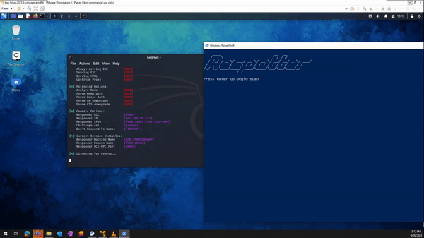

# 

## The Responder Honeypot

This application detects active instances of [Responder](https://github.com/lgandx/Responder) by taking advantage of the fact that Responder will respond to any DNS query. Respotter uses LLMNR, mDNS, and NBNS protols to search for a bogus hostname that does not exist (default: Loremipsumdolorsitamet). If any of the requests get a response back, then it means that Responder is likely running on your network.

Respotter can send webhooks to Slack, Teams, or Discord. It also supports sending events to a syslog server to be ingested by a SIEM.

## Quick start

```bash
docker run --rm --net=host ghcr.io/lawndoc/respotter
```

*Note: `--net=host` is required due to privileged socket usage when crafting request packets*

For additional container deployment documentation, please refer to [the wiki](https://github.com/lawndoc/Respotter/wiki)

## Demo



## Additional configuration

You can configure Respotter with a configuration file or command line arguments.

Precedence: defaults < config file < cli arguments

1. Clone the repo:

```bash
git clone https://github.com/lawndoc/Respotter
cd Respotter
```

2. Create your config file:

```bash
cp config.json.template config.json
vim config.json
```

3. Setup a venv and run the script:

```bash
python3 -m venv venv
./venv/bin/pip install -r requirements.txt
sudo ./venv/bin/python ./respotter.py -c config.json
```

*or*

3. Mount the config and run with docker:

```bash
mkdir config && mv config.json config/
docker run --rm -d --net=host -v config:/config --name=respotter ghcr.io/lawndoc/respotter:latest -c config/config.json
```

## Output

When Responder is found on your network:

`[!] [<PROTOCOL>] Responder detected at: X.X.X.X - responded to name 'Loremipsumdolorsitamet'`

## License

[MIT](https://choosealicense.com/licenses/mit/)

## Contributors

This project was originally created by [Baden Erb](https://badenerb.com) ([@badenerb](https://github.com/badenerb))

Current maintainers:

* [C.J. May](https://cjmay.info) ([@lawndoc](https://github.com/lawndoc))
* [Matt Perry]() ([@xmjp](https://github.com/xmjp))
